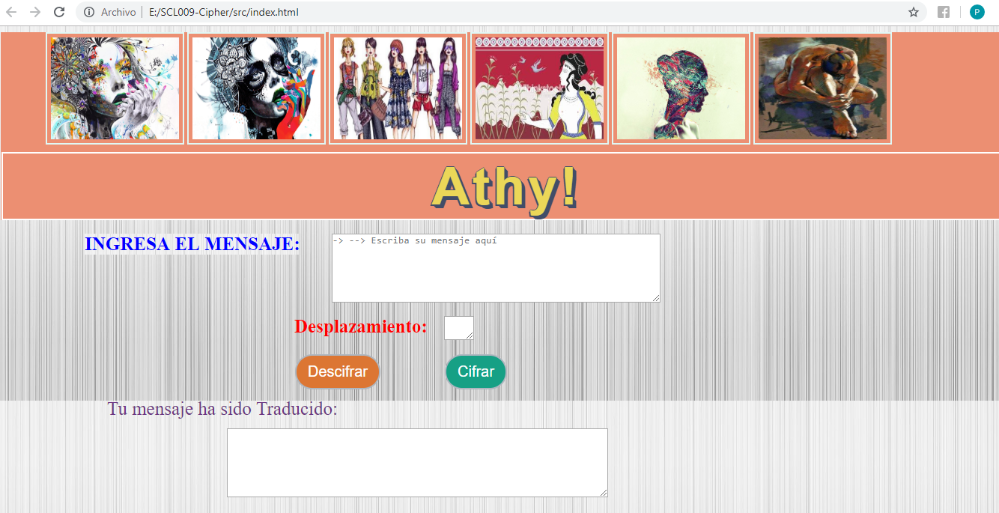
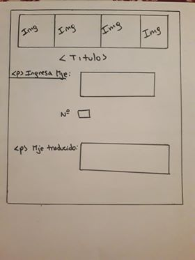
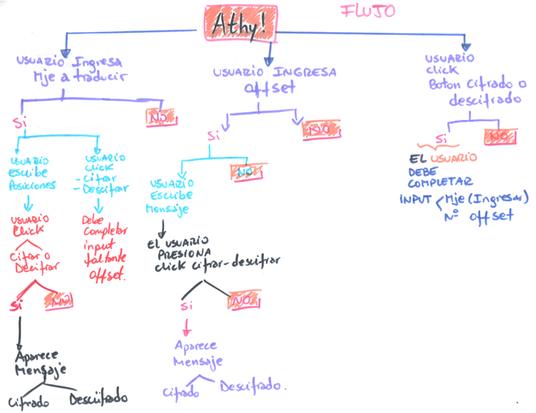

# PROYECTO CÓDIGO CESAR "Athy!"

## Descripcion del proyecto:

### Athy! 

    Primera aplicación web desarrollada en el proyecto bootcamp. 

**Athy!** 

Consiste en un aplicación tipo servicio dirigido a usuarias mujeres, esta iniciativa esta destinada a grupos en **ayuda, guía y acompañamiento** de usuarias con incertidumdre, respecto a situación de control o violencia que esten viviendo junto a sus parejas. 

La aplicación utiliza un cifrado y descifrado, controlado por líderes de grupos de ayuda y usuarias a través de un parámetro único númerico. 

Por lo tanto la temática utilizada en el proyecto es **mensajeria secreta**.

#### Definición del producto:

Proceso para definir el producto a nivel de experiencia y de interfaz:

* ¿Quiénes son los **principales usuarios** de producto?

    Las principales ususarias son **mujeres**, se desea que la aplicacion sea utilizada por departamentos de carabineros, municipalidades, **grupos activas de mujeres** que tienen en sus proposito la ayuda, acompañamiento u orientación a mujeres, ya sean: jovenes, adultas o de edad, que se encuentren en alguna situacion de duda o certeza de ser controladas, violentadas u otro estado evaluado por sus parejas.

* ¿Cuáles son los objetivos de estos usuarios en relación con el producto/AThy!?

    Los usuarios serán lideres de estas organizaciones, personas a cargo que dispondrán de esta **herramienta web**, donde las usuarias  acceden para enviar mensajes de manera secreta, con un cifrado cesar que no es de comun conocimiento, en el cual a través del parámetro único numérico "offset" que pueden manipular solo ellas, en beneficio de ser victimas reales. 

    El objetivo principal de esta aplicación creada en el bootcamp, es el comienzo de una aplicación que permita a estos grupos activos(carabineros, centro social, municipalidad, etc), poder acercarse a las usuarias a través de una aplicación donde la interacción de la usuaria será inmediata y no tendrá que dirigirse a la ubicación de estas instituciones, además el mensaje queda registrado en el instante. 

    * El registro de los mensajes se estima como desarrollo en otra fase del proyecto. 

- ¿Cómo el producto/Athy!  resuelve problemas?

    Como se indicó en la interrogante anterior, este producto permite reemplazar el traslado de las mujeres a las instituciones, en el cual muchas de ellas deciden no informar, no pedir ayuda o en el mayor de los casos no recibir orientación.

    Al ser una aplicación web, permite masificar el uso del producto, y que un gran número de usuarios reciban información u orientación sobre dudas de conductas que puedan tener. 

    Al ser una aplicación inmediata, los grupos activos tendrán acceso a la información y registro de esta, en caso de ser necesarias en el futuro, con la redacción y detalle adjunto. 

### Interfaz de usuario (UI):

**La interfaz  permite al usuario**:

- Utilizar un  desplazamiento (_offset_) indicando cuántas posiciones en el cifrado se desplaza cada caracter/letra.
- Insertar un mensaje (texto) para cifrar o insertar un mensaje (texto) a descifrar.
- Ver el resultado del mensaje cifrado.
- Ver el resultado del mensaje descifrado.

A continuacion una imagen de la aplicación: 

Como se observa en la imagen, la aplicación tiene los elementos para que el usuario pueda utilizarla con contenedores de texto, y botones visibles para la traducción. 

**Diseño de experiencia de usuario (User Experience Design):**

- Ideación:
        
    La idea nace a través de una conversacion con una dirigenta vecinal, quien precisa la nula comunicación que existe entre algunas mujeres que subren de agresión en zona residencial en la cual ella vive.

    Se propone un bosquejo simple con elementos específicos, que sean faciles de identificar, con pocos procedimientos para las usuarias, de sencilla utilización. 

    Se crea a partir de posibles usuarias un **Flujo Usuario** (Prototipado punto 2),el cual es la base de los eventos necesarios (DOM).

- Prototipado (sketching)

    1. Bosquejo inicial: 

        
 
    2. Flujo usuario:

        

-   3.   Testeo e Iteración:

En este punto la aplicación fue iterada una vez construida la estructura en archivo HTML y post haber agregado elementos en archivo CSS.

La iteración se realizó cifrado y descrifrado para letras mayusculas y minusculas. 

## Proceso y desición de diseño:

El proceso de diseño consistió en utilizar elementos determinados en el bosquejo inicial, considerando simplicidad en la aplicación, visual con colores llamativos e imagenes con efectos. 

